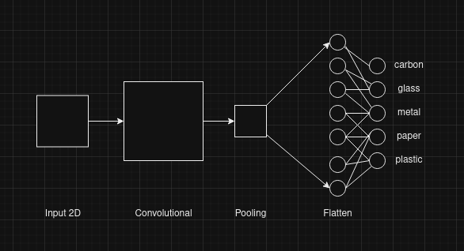

# Image Classification Service Description

A Docker image was utilized containing Jupyter Notebook, Python, and the Keras library.
- [docker image gustavovinicius/guspy:jupyterkeras](https://hub.docker.com/layers/gustavovinicius/guspy/jupyterkeras/images/sha256-10e14a48926d47a762b735bd2f6f60f83bdb9559764885a21e7b2086abfd9a5b?context=repo)
- [Settup](./Settup.md)
- [API Doc](./API.md)

## Image Classification Details:

Image object classification is performed by learning small features of the image, which are passed through multiple layers of the neural network with the goal of minimizing parameters for classification.

### Network Architecture:

The network consists of three pairs of convolutional and pooling layers, a flattening layer, and a classification layer.

- **Convolutional Layers:**
  - Responsible for learning patterns and object features in images.
  - Uses filters specifying RGB color patterns and an activation function for perceptrons.
  - Returns a vector of learned features in the image.

- **Pooling Layers:**
  - Reduces the number of parameters returned by convolutional layers using a statistical function (softmax).
  - Aims to decrease network size and optimize learning for the next convolutional layer.

- **Flatten Layer:**
  - Converts the result of the pooling layer to a vector formatted for the classification layer.

- **Fully Connected Layer:**
  - Learns to classify the object from the features filtered by previous layers.
  - Learning occurs through the backpropagation algorithm adjusting weights between network connections.

- **Classification Layer:**
  - Has an artificial neuron for each class, using an activation function to determine the probability of the input belonging to a class.

## Technical Details:

```python
Conv2D(32, (3, 3), input_shape=(img_width, img_height, 3), activation='relu'):
   - Convolutional layer with 32 filters/kernels of size (3, 3).
   - Input shape for RGB images (img_width, img_height, 3).
   - ReLU activation function.

MaxPooling2D(pool_size=(2, 2)):
   - Max pooling layer with a pool size of (2, 2).
   - Downsampling by taking the maximum value in a 2x2 window.

Flatten():
   - Layer to flatten the input, transforming 2D matrix data to a vector.

Dense(256, activation='relu'):
   - Fully connected layer with 256 neurons.
   - ReLU activation function.

Dense(5, activation='softmax'):
   - Final output layer with 5 neurons representing classes.
   - Softmax activation for multi-class classification, converting output to a probability distribution.
```

## Network Diagram:

