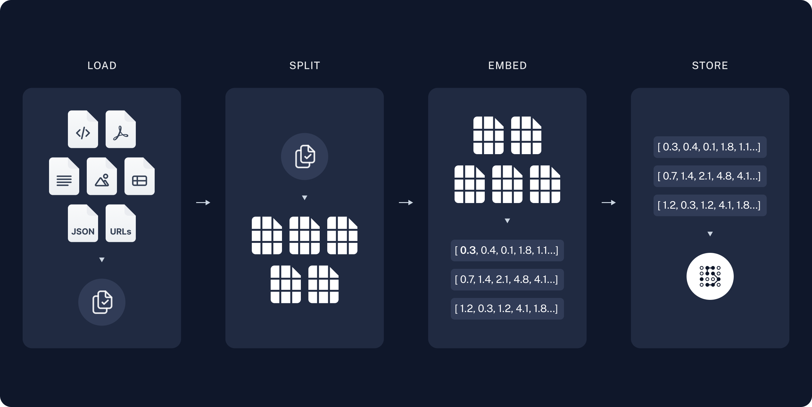

# Blanck Jupyter Notebook Docker Environment

### Gustavo Vinicius Morais

- [Pandas](./pandas.md)

### The changes are in the branch
```
[branch/langchain]
```

### Requirements
- [LLM Ollama](https://ollama.com/)
- [Ollama ModelFile](https://github.com/ollama/ollama/blob/main/docs/modelfile.md)
- [LangChain](https://python.langchain.com/v0.2/docs/introduction/)

```
sudo docker-compose up -d --build
sudo docker exec -it [container_name_1] sh
jupyter notebook --ip=0.0.0.0
jupyter server list // get the token to login
```

### Local ollama
```sh
curl -fsSL https://ollama.com/install.sh | sh
ollama 
ollama serve
# At another cli tab run
ollama pull nomic-embed-text
ollama pull mistral
# The server must be running
# The langchain in the jupyter notebook already nows the port to request, no need to config the local endpoint
```
### RAG (Retrieval Augmented Generation)
- [Code example](./scripts/rag_pdf_v2.ipynb)
- [Vectore Store from PDFs](./scripts/VectorStore.ipynb)
- [Build documents DB](https://python.langchain.com/docs/integrations/vectorstores/chroma/)
- [RAG Chat](https://python.langchain.com/v0.2/docs/tutorials/qa_chat_history/)
<br><br>

